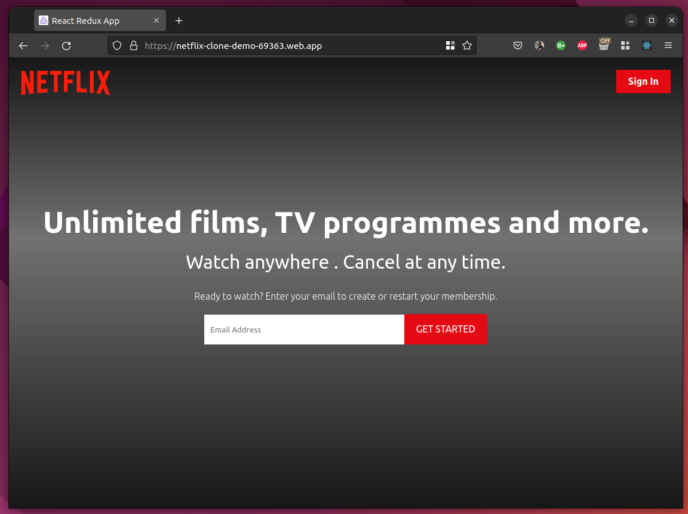
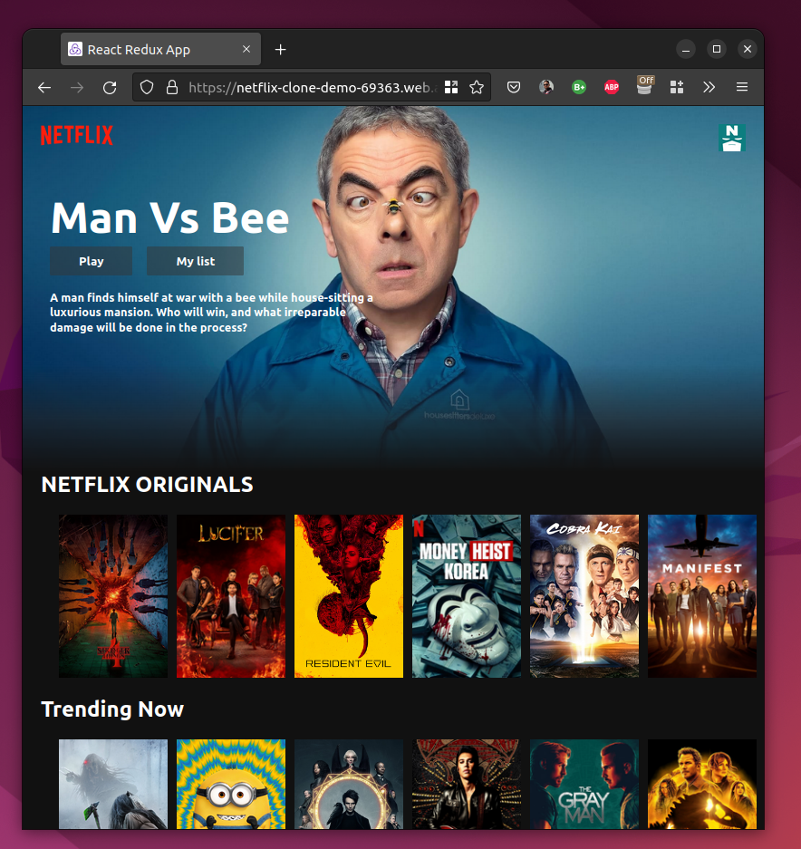
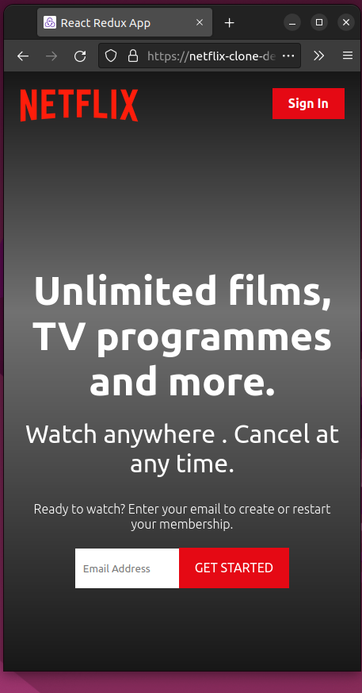
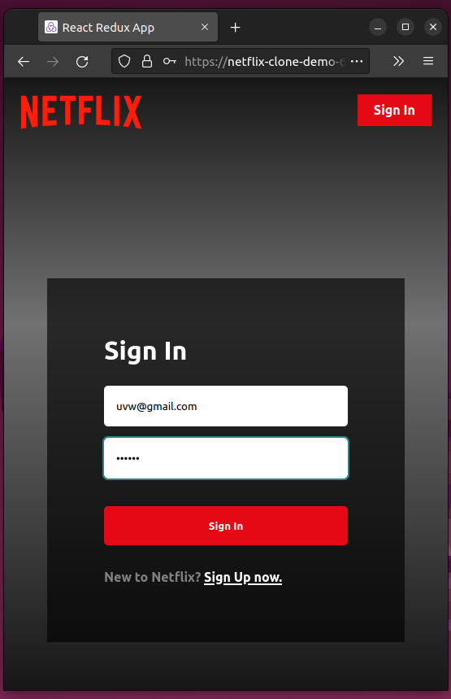

### Netflix:

Netflix dummy app which looks like real application. with firebase authentication and user management. The Aim of development was to understand the process of building and integration of a web application using react components.

- Firebase v9
- React js Framework ( web hooks, Redux for global state management )
- CSS 3
- TMDB The Movie Database API endpoint for metadata streaming.
- User management using Firebase Auth
- Functinal Component.
- Keeping user friendly UI by keeping the component sizes and colours consistent

Web url: <https://netflix-clone-demo-69363.firebaseapp.com/>

Screenshots:

